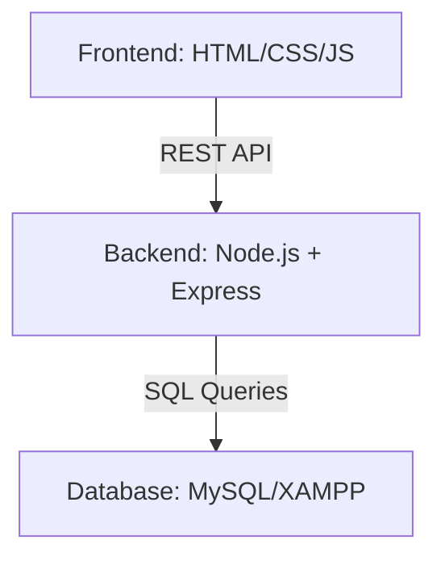

# Hệ Thống Giám Sát Sản Xuất & Theo Dõi Lỗi (Production Monitoring & Defect Tracking System)

Hệ thống giám sát định hướng sản xuất được phát triển để mô phỏng môi trường sản xuất SMT.

Dự án này cung cấp khả năng giám sát dây chuyền sản xuất theo thời gian thực, theo dõi lỗi, nhật ký sản xuất và các chức năng quản lý dựa trên vai trò được lấy cảm hứng từ quy trình MES (Hệ thống điều hành sản xuất) được sử dụng trong các nhà máy điện tử.

Hệ thống được thiết kế để mô phỏng các quy trình giám sát sản xuất thực tế bao gồm quản lý trạng thái dây chuyền, báo cáo lỗi, thống kê sản xuất và ghi nhật ký vận hành.

## Kiến Trúc Hệ Thống

## Công Nghệ Sử Dụng

### Backend
- **Node.js**: Môi trường thực thi
- **Express.js**: Web framework
- **RESTful API**: Tiêu chuẩn giao tiếp
- **JWT**: Xác thực bảo mật

### Cơ Sở Dữ Liệu
- **MySQL**: Hệ quản trị cơ sở dữ liệu quan hệ
- **phpMyAdmin**: Công cụ quản trị cơ sở dữ liệu

### Frontend
- **HTML5**: Cấu trúc
- **CSS3**: Định dạng (Glassmorphism & Giao diện sáng)
- **Bootstrap**: Các thành phần đáp ứng (Responsive)
- **JavaScript**: Logic frontend và tích hợp API

### Công Cụ
- **VS Code**: Trình soạn thảo mã nguồn
- **GitHub**: Quản lý phiên bản
- **Postman**: Kiểm thử API
- **XAMPP**: Môi trường máy chủ cục bộ (Apache & MySQL)

## Các Tính Năng Chính

### Xác Thực & Phân Quyền
- **Đăng Nhập Bảo Mật**: Hệ thống xác thực người dùng.
- **RBAC**: Kiểm soát truy cập dựa trên vai trò (Admin, Engineer, Operator).
- **Quản Lý Phiên**: Xử lý phiên dựa trên JWT.

### Giám Sát Sản Xuất
- **Trạng Thái Thời Gian Thực**: Giám sát trực tiếp các dây chuyền sản xuất SMT.
- **Theo Dõi Sản Lượng**: Trực quan hóa sản lượng sản xuất hàng ngày.
- **Quản Lý Trạng Thái**: Theo dõi trạng thái máy (Đang chạy, Dừng, Cảnh báo).

### Theo Dõi Lỗi (Defect Tracking)
- **Kiểm Soát Chất Lượng**: Mô phỏng việc phát hiện lỗi AOI/SPI.
- **Ghi Nhật Ký Lỗi**: Báo cáo chi tiết các loại lỗi và số lượng.
- **Thống Kê**: Trực quan hóa các chỉ số chất lượng trên bảng điều khiển.

### Nhật Ký Sản Xuất
- **Lịch Sử Hoạt Động**: Dòng thời gian chi tiết của các sự kiện sản xuất.
- **Theo Dõi Sự Kiện**: Ghi nhật ký vận hành để đảm bảo tính minh bạch.
- **Giám Sát Thời Gian Dừng**: Theo dõi các lần dừng dây chuyền và bảo trì.

### Bảng Điều Khiển (Dashboard)
- **Thống Kê Tổng Hợp**: Các số liệu sản xuất cấp cao.
- **Chỉ Số Chất Lượng**: Trực quan hóa tỷ lệ lỗi.
- **Tổng Quan Dây Chuyền**: Lưới trạng thái toàn diện của tất cả các dây chuyền.

## Thiết Kế Cơ Sở Dữ Liệu

Các bảng chính:
- `users`: Hồ sơ người dùng và vai trò.
- `production_lines`: Cấu hình dây chuyền và trạng thái hiện tại.
- `defects`: Bản ghi các vấn đề chất lượng.
- `production_logs`: Lịch sử vận hành.

Cơ sở dữ liệu được thiết kế bằng các nguyên tắc mô hình hóa quan hệ để hỗ trợ theo dõi quy trình làm việc và quản lý dữ liệu sản xuất.

## Cấu Trúc API

### Xác Thực
- `POST /api/auth/login`: Đăng nhập người dùng và tạo token.
- `GET /api/auth/me`: Lấy hồ sơ người dùng hiện tại.

### Dây Chuyền Sản Xuất
- `GET /api/lines`: Danh sách tất cả các dây chuyền sản xuất.
- `GET /api/lines/:id`: Lấy thông tin chi tiết của một dây chuyền cụ thể.
- `PATCH /api/lines/:id/status`: Cập nhật trạng thái dây chuyền.

### Lỗi (Defects)
- `GET /api/defects`: Lấy tất cả nhật ký lỗi.
- `POST /api/defects`: Báo cáo lỗi mới.
- `GET /api/defects/stats`: Lấy thống kê lỗi cho biểu đồ.

### Nhật Ký (Logs)
- `GET /api/logs`: Lấy các nhật ký sản xuất gần đây.
- `POST /api/logs`: Thêm bản ghi nhật ký thủ công mới.

## Hướng Dẫn Cài Đặt
1. **Cơ sở dữ liệu**: Nhập file `production_monitoring.sql` vào MySQL của bạn (XAMPP).
2. **Backend**:
   - `cd backend`
   - `npm install`
   - Cấu hình file `.env` (DB_USER, DB_PASS, PORT=3000).
   - Khởi động server: `node app.js`
3. **Frontend**:
   - Mở `frontend/index.html` qua XAMPP hoặc truy cập file trực tiếp.

## Tài Khoản Mặc Định
- **Admin**: `admin01` / `123456`
- **Engineer**: `engineer01` / `123456`
- **Operator**: `operator01` / `123456`

## Ảnh Chụp Màn Hình

### Bảng Điều Khiển (Dashboard)

### Quản Lý Lỗi

### Nhật Ký Sản Xuất

## Cải Tiến Trong Tương Lai
- **Docker**: Triển khai dưới dạng container.
- **WebSockets**: Thông báo đẩy thời gian thực cho các lỗi dây chuyền.
- **Phân Tích**: Trực quan hóa dữ liệu nâng cao bằng Chart.js.
- **Theo Dõi**: Tích hợp Barcode/QR để theo dõi linh kiện.
- **Báo Cáo**: Tự động xuất báo cáo Excel/PDF.
- **OEE**: Phân tích chi tiết hiệu suất thiết bị (OEE).

## Kết Quả Học Tập
Thông qua dự án này, tôi đã cải thiện hiểu biết về:
- Hệ thống quy trình sản xuất và khái niệm MES.
- Phát triển Backend RESTful API với Node.js.
- Thiết kế cơ sở dữ liệu quan hệ và các truy vấn SQL phức tạp.
- Thiết kế UI/UX hiện đại (Glassmorphism & Light Theme).
- Quy trình bảo mật dựa trên vai trò và xác thực.

## Tác Giả

**Hoang Le Huy**

- GitHub: [Production-Monitoring-Defect-Tracking-System](https://github.com/mai93379-beep/Production-Monitoring-Defect-Tracking-System)
