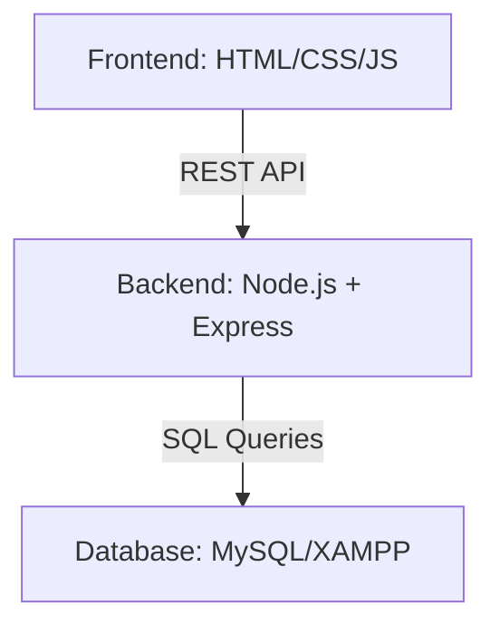
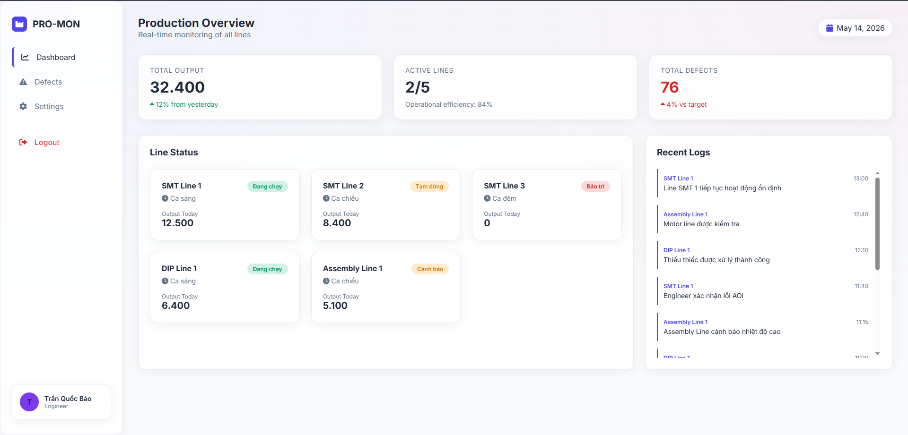
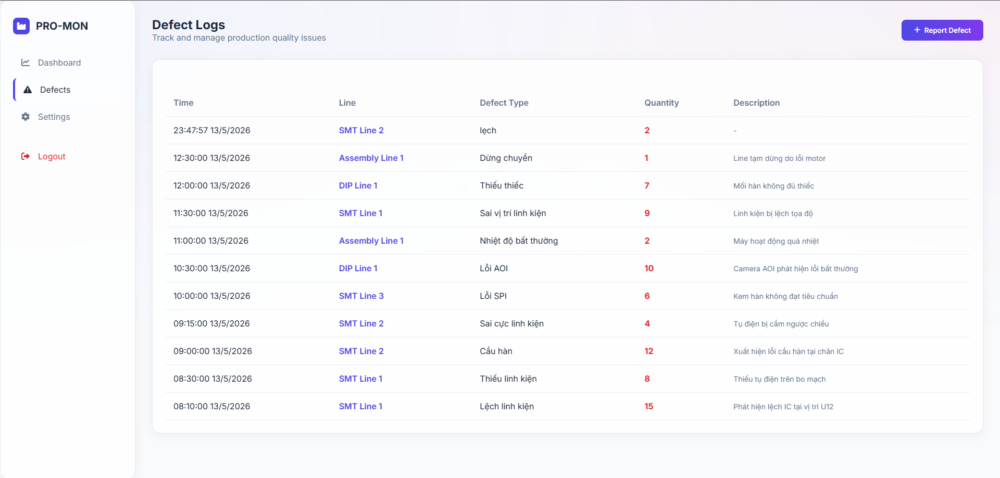
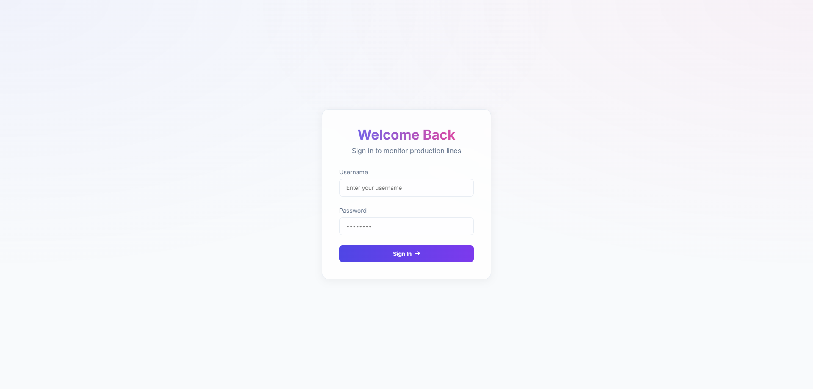

# Production Monitoring & Defect Tracking System

A manufacturing-oriented monitoring system developed for SMT production environment simulation.

This project provides real-time production line monitoring, defect tracking, production logging, and role-based management functionalities inspired by MES (Manufacturing Execution System) workflows used in electronics factories.

The system was designed to simulate practical production monitoring processes including line status management, defect reporting, production statistics, and operational logging.

## System Architecture

## Technology Stack

### Backend
- **Node.js**: Runtime environment
- **Express.js**: Web framework
- **RESTful API**: Communication standard
- **JWT**: Secure authentication

### Database
- **MySQL**: Relational database management
- **phpMyAdmin**: Database administration tool

### Frontend
- **HTML5**: Structure
- **CSS3**: Styling (Glassmorphism & Light Theme)
- **Bootstrap**: Responsive components
- **JavaScript**: Frontend logic and API integration

### Tools
- **VS Code**: IDE
- **GitHub**: Version control
- **Postman**: API testing
- **XAMPP**: Local server environment (Apache & MySQL)

## Main Features

### Authentication & Authorization
- **Secure Login**: User authentication system.
- **RBAC**: Role-based access control (Admin, Engineer, Operator).
- **Session Management**: JWT-based session handling.

### Production Monitoring
- **Real-time Status**: Live monitoring of SMT production lines.
- **Output Tracking**: Daily production output visualization.
- **Status Management**: Machine status tracking (Running, Stopped, Warning).

### Defect Tracking
- **Quality Control**: Simulation of AOI/SPI defect detection.
- **Defect Logging**: Detailed reporting of defect types and quantities.
- **Statistics**: Dashboard visualization of quality metrics.

### Production Logs
- **Activity History**: Detailed timeline of production events.
- **Event Tracking**: Operational logging for transparency.
- **Downtime Monitoring**: Tracking of line stops and maintenance.

### Dashboard
- **Consolidated Stats**: High-level production statistics.
- **Quality Metrics**: Visualization of defect rates.
- **Line Overview**: Comprehensive status grid of all lines.

## Database Design

Main tables:
- `users`: User profiles and roles.
- `production_lines`: Line configuration and current status.
- `defects`: Records of quality issues.
- `production_logs`: Operational history.

The database was designed using relational modeling principles to support production workflow tracking and manufacturing data management.

## API Structure

### Authentication
- `POST /api/auth/login`: User login and token generation.
- `GET /api/auth/me`: Retrieve current user profile.

### Production Lines
- `GET /api/lines`: List all production lines.
- `GET /api/lines/:id`: Get detailed info for a specific line.
- `PATCH /api/lines/:id/status`: Update line status.

### Defects
- `GET /api/defects`: Retrieve all defect logs.
- `POST /api/defects`: Report a new defect.
- `GET /api/defects/stats`: Get defect statistics for charts.

### Logs
- `GET /api/logs`: Retrieve recent production logs.
- `POST /api/logs`: Add a new manual log entry.

## Installation Guide
1. **Database**: Import `production_monitoring.sql` into your MySQL (XAMPP).
2. **Backend**:
   - `cd backend`
   - `npm install`
   - Configure `.env` (DB_USER, DB_PASS, PORT=3000).
   - Start server: `node app.js`
3. **Frontend**:
   - Open `frontend/index.html` via XAMPP or direct file access.

## Default Credentials
- **Admin**: `admin01` / `123456`
- **Engineer**: `engineer01` / `123456`
- **Operator**: `operator01` / `123456`

## Screenshots

### Dashboard

### Defect Management

### Production Logs

## Future Improvements
- **Docker**: Containerized deployment.
- **WebSockets**: Real-time push notifications for line errors.
- **Analytics**: Advanced data visualization using Chart.js.
- **Tracking**: Barcode/QR integration for component tracking.
- **Reporting**: Automated Excel/PDF report exports.
- **OEE**: Detailed machine performance analysis (OEE).

## Learning Outcomes
Through this project, I improved my understanding of:
- Manufacturing workflow systems and MES concepts.
- Backend RESTful API development with Node.js.
- Relational database design and complex SQL queries.
- Modern frontend UI/UX design (Glassmorphism & Light Theme).
- Role-based security and authentication workflows.

## Author

**Hoang Le Huy**

- GitHub: [Production-Monitoring-Defect-Tracking-System](https://github.com/mai93379-beep/Production-Monitoring-Defect-Tracking-System)
